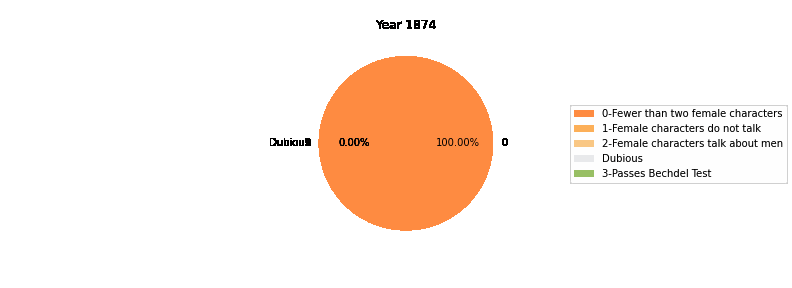

# HCDS-Bechdel-Test-Final-Project

CDAD-UH - 1044Q Human Centered Data Science | Fall 2021 | Final Project

Alison Yao, Fatima Nadeem, Min Jie Kim, Jun Bin Ho

## Description

## Datasets

1. [Bechdel test data](https://bechdeltest.com/) (API supported):
   `Data/Bechdel_detailed.csv`.

   Code for API usage is in the notebook `Data/Bechdel_api.ipynb`.

   Detailed explanation and active discussion about this dataset can be found on [Kaggle](https://www.kaggle.com/alisonyao/movie-bechdel-test-scores).

2. [Crew & Cast Gender data](https://www.kaggle.com/rounakbanik/the-movies-dataset?select=credits.csv) from Kaggle:

   Please download the data directly from Kaggle and put the file in the same directory as the `Data` file. Or put it somewhere else and change the paths for all read_csv. I am not uploading the cast & crew gender data here because the file is too large.

   Example code for cleaning the credits.csv data and extracting gender ratio information is in `all_credits_gender.ipynb`.

   <!-- TODO: post Kaggle notebook -->

## Code

### Analysis-related

- `Bechdel_analysis.ipynb` analyzes and visualizes the Bechdel_detailed.csv data.

  

### Data-related

- `Data/Bechdel_api.ipynb` shows you how to use the API to fetch data from https://bechdeltest.com/.

- `Data/all_cast_crew_gender.ipynb` is an example of how to clean the cast and crew info from the original Kaggle dataset.

- `Data/Bechdel_filter_credits.ipynb` is joining datasets and putting useful information together.

## Packages

Since a large proportion of crew members have their gender labeled unknown in the original Kaggle dataset, I used a **gender prediction package** called [gender-guesser](https://pypi.org/project/gender-guesser/) to predict the unknowns.
