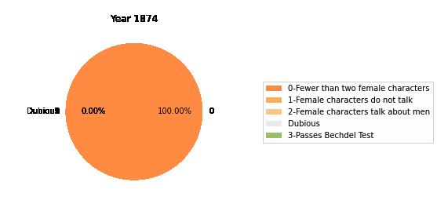

# HCDS-Bechdel-Test-Final-Project

CDAD-UH - 1044Q Human Centered Data Science | Fall 2021 | Final Project

Alison Yao (yy2564), Fatima Nadeem (fn2093), Min Jie Kim (mjk9913), Jun Bin Ho (jbh439)

## Description

"The Bechdel Test is a simple and popular measure of feminism in works of fiction. The rules of the test were first defined back in 1985 in a comic strip featuring two queer women who could not find a movie that:

- Has at least two women in it,
- who talk to each other,
- about something other than a man.

Encountering such mixed reviews of the Bechdel Test, we wanted to design our research questions to acknowledge the success and ups of the Bechdel Test, while also navigating the shortcomings of the test. We hope to learn about methods or proxies to measure the human-centered issue of representation, which requires us to think about how we can qualify how movies depict women. We also hope to explore how we can leverage other quantitative benchmarks as a tool to “fill the gaps” of the Bechdel test. Therefore, this report will explore the questions of:

- How are movies performing based on the Bechdel Test compared to other off-screen metrics
- What are its shortcomings??
- What additional metrics or revisions we can take to better measure feminism in films and filmmaking?"

## Data

1. [Bechdel test data](https://bechdeltest.com/) (API supported):
   `Data/Bechdel_detailed.csv`.

   Code for API usage is in the notebook `Data/Bechdel_api.ipynb`.

   Detailed explanation and active discussion about this dataset can be found on [Kaggle](https://www.kaggle.com/alisonyao/movie-bechdel-test-scores).

2. [Crew & Cast Gender data](https://www.kaggle.com/rounakbanik/the-movies-dataset?select=credits.csv) from Kaggle:

   Please download the data directly from Kaggle and put the file in the same directory as the `Data` file. Or put it somewhere else and change the paths for all read_csv. I am not uploading the cast & crew gender data here because the file is too large.

   Example code for cleaning the credits.csv data and extracting gender ratio information is in `all_credits_gender.ipynb`.

## Code

### Analysis-related

- `Bechdel_analysis.ipynb` analyzes and visualizes the Bechdel_detailed.csv data.

  

- `Bechdel_filter_credits.ipynb` join the Bechdel data with the female ratio data and analyze a larger dataframe.

### Data-related

- `Data/Bechdel_api.ipynb` shows you how to use the API to fetch data from https://bechdeltest.com/.

- `Data/all_cast_crew_gender.ipynb` is an example of how to clean the cast and crew info from the original Kaggle dataset.

## Packages

Since a large proportion of crew members have their gender labeled unknown in the original Kaggle dataset, I used a **gender prediction package** called [gender-guesser](https://pypi.org/project/gender-guesser/) to predict the unknowns.

## Blog

Please check out [this Medium blog](https://towardsdatascience.com/bechdel-test-comparing-female-representation-metrics-in-movies-6cbade15010f) for a detailed explanation of the project.
